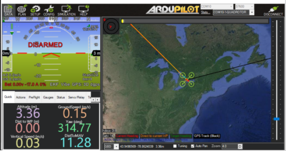
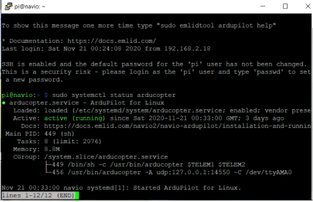
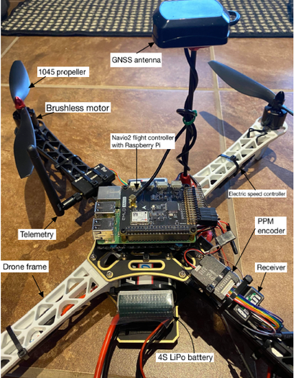

# DroneApplication

Welcome to the DroneApplication repository! This is the complete final year project showcasing a system that integrates a smart UAV (Unmanned Aerial Vehicle) with an iOS application. The drone is equipped with advanced features such as face detection, obstacle detection, and voice assistance, all controlled by a Raspberry Pi as the drone's brain.

## Features

- **Smart UAV with Face and Obstacle Detection**: The drone uses a Raspberry Pi for processing and can detect faces and obstacles in real-time.
- **Remote Connectivity**: The iOS app can connect to the drone from anywhere in the world.
- **Voice Assistance**: Control the drone with voice commands via the app.
- **Flight Modes**: Switch between different flight modes for varying operational needs.
- **Flight Path Setting**: Predefine the drone's flight path directly from the app.

## Project Structure

- `src/` - Contains the source code for the drone's onboard software and the iOS application.
- `images/` - Contains images related to the project.
- `docs/` - Contains detailed documentation of the project.

## Screenshots

Here are some screenshots and visuals that illustrate the project:


*Figure 1: The drone Setup.*



*Figure 2: GCS interface showing real-time data from the drone.*



## Getting Started

### Prerequisites

- Raspberry Pi (Model 3B+ or later)
- iOS Device with iOS 14 or later
- Xcode 12 or later (for building the iOS app)

### Installation

1. Clone the repository:
    ```bash
    git clone https://github.com/yourusername/DroneApplication.git
    ```
2. Navigate to the project directory:
    ```bash
    cd DroneApplication
    ```
3. Follow the instructions in the `docs/` folder to set up the drone and iOS app.

### Usage

- **Starting the Drone**: Follow the setup guide in the `docs/` folder to power on the drone and connect it to the iOS app.
- **Using the iOS App**: Open the iOS app on your device, connect to the drone, and start controlling it using the available features.

## Contributing

Contributions are welcome! Please fork the repository and submit a pull request with your changes.

## License

This project is licensed under the MIT License - see the [LICENSE](./LICENSE) file for details.
